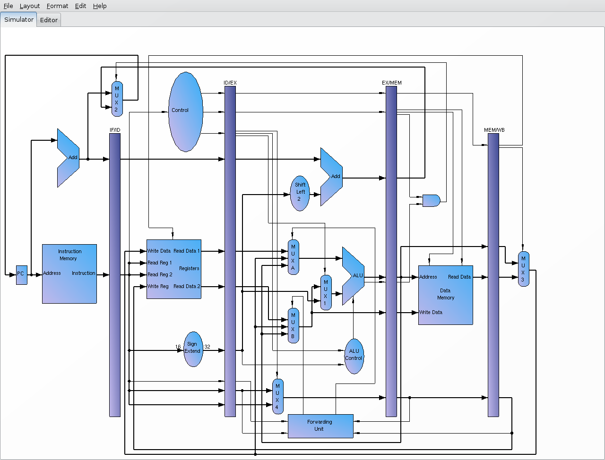

# ORG
Projeto e desenvolvimento de um processador Mips

##  Caminho de Dados
    
    

## Instruções com 32 bits
    
    Instruções:
        Tipo R => | 6-opcode | 5-reg1 | 5-reg2 | 5-reg3 | 5- shampt | 6-func |
        Tipo I => | 6-opcode | 5-reg1 | 5-reg2 |         16- dest            |
        Tipo J => | 6-opcode |               26-destino                      |
    
            Formato           |         Resultado
        ---------------------   ------------------------------
        jpm [mem]             |      Desvio
        add $s1, $s2, $s3     |      $s1 =  %s2 +  %s3
        sub $s1, $s2, $s3     |      $s1 =  %s2 -  %s3
        sll $s1, $s2, $s3     |      $s1 =  %s2 << %s3
        srl $s1, $s2, $s3     |      $s1 =  %s2 >> %s3
        and $s1, $s2, $s3     |      $s1 =  %s2 &  %s3
        or  $s1, $s2, $s3     |      $s1 =  %s2 |  %s3
        slt $s1, $s2, $s3     |      $s1 = ($s2 <  $s3) ? 1:0

        lw  $s1, [offsize] $s2      $s1 = mem[offsize + %s2]
        sw  $s1, [mem] $s2          mem[offsize + $s2] = $s1
        bqe %s1, $s2, [mem]         
        bne %s1, $s2, [mem]    